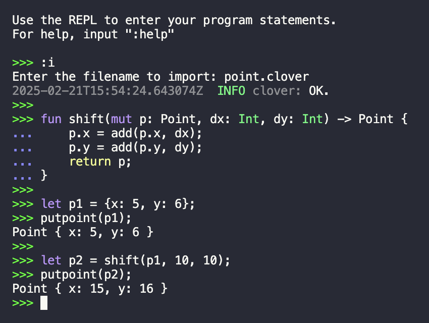

# clover

Clover is a C-alternative that can be compiled with LLVM or C, or interpreted line-by-line!



## Features

- [x] `union`, `struct`, `enum`, pointer mutability semantics
- [x] Convenient C ABI compatibility
- [x] Compilation
    - [x] REPL
        - [ ] LLVM JIT
    - [x] C code generation
    - [x] LLVM IR generation
    - [x] [Mage](https://github.com/adam-mcdaniel/mage) code generation
- [x] Type inference
    - [ ] Hindley-Milner type inference
- [x] Type checking
- [ ] Slice types

## Example

Here is a program that calculates the factorial of the factorial of 3:

```kotlin
extern fun le(a: Int, b: Int) -> Bool;
extern fun putint(value: Int);
extern fun putln();
extern fun putstr(str: &Char);
extern fun sub(a: Int, b: Int) -> Int;
extern fun mul(a: Int, b: Int) -> Int;

fun factorial(n: Int) -> Int {
    if le(n, 1) {
        return 1;
    }
    return mul(n, factorial(sub(n, 1)));
}

let n = 3;
putstr("Factorial of factorial of ");
putint(n);
putstr(" is ");
putint(factorial(factorial(n)));
putln();
```

The output of this program is `Factorial of factorial of 3 is 720`.

## Usage

To install the Clover compiler, run the following command:

```shell
$ cargo install --git https://github.com/adam-mcdaniel/clover
```

### REPL

To start the REPL, simply run the project without any arguments!

```shell
$ cargo run
$ # or
$ clover
```

### Compile

By default, Clover programs support no library functions. To use external functions, you must declare them with the `extern` keyword. For example, to use the `putint` function, you must declare it as follows:

```kotlin
extern fun putint(value: Int);
```

Then, you can link the external functions with the `-L` flag:

```shell
$ clover -L /path/to/library.clover /path/to/program.clover
```

For all the programs in the [`examples`](examples) directory, you can compile them with the following command:

```shell
$ clover examples/*.clover -L examples/std.c
```

This will compile with LLVM and generate an executable named `main.exe`.

### Generate C code

To generate C code, use the `-t` (`--target`) flag:

```shell
$ clover examples/*.clover -L examples/std.c -t c 
```

This will generate a C program named `main.c`.

## License

This project is licensed under the MIT License - see the [LICENSE](LICENSE) file for details.

## About the Author

Hello, [I'm Adam McDaniel](https://adam-mcdaniel.github.io/), a software engineer and computer science PhD student at the University of Tennessee Knoxville. I'm passionate about programming languages, compilers, and formal methods. I'm a huge fan of Rust and functional programming, and I love building tools that help people write better software.

Here's some interesting links for some of my other projects:

### My Interesting Links

|Website|
|---|
|[My programming language🧑‍💻](https://adam-mcdaniel.net/sage-website)|
|[My shell🐚](https://adam-mcdaniel.net/dune-website/)|
|[My YouTube📽️ (compilers and music)](https://youtu.be/QdnxjYj1pS0?si=pwvegcPkEvqmqF8b)|
|[My blog📝](https://adam-mcdaniel.net/blog)|
|[My logic language🧮](https://github.com/adam-mcdaniel/reckon)|
|[My online BrainF*** interpreter🧠](https://adam-mcdaniel.github.io/harbor)|